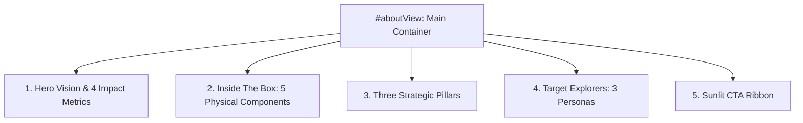

# Kiến Trúc Tái Thiết Kế Phân Hệ "Giới Thiệu Về LogisQuest" (Sunlit Maritime Light Mode)

Tài liệu tri thức chuẩn mực về phân hệ **"Về LogisQuest" (`#aboutView`)** được tái cấu trúc toàn diện theo thiết kế sinh từ Google Stitch MCP (`Screen ID: e155efac591f453cb58a824d825a59d6`, Project `14334326521163640139`).

---

## 1. Định Vị & Triết Lý Thiết Kế

- **Phong cách cốt lõi:** **Sunlit Maritime Light Mode** (Khơi nguồn cảm hứng hàng hải ngập tràn ánh nắng tự nhiên, tươi sáng, sang trọng và hiện đại).
- **Rào chắn bắt buộc (Critical Invariant):** **TUYỆT ĐỐI KHÔNG DÙNG NỀN TỐI ĐEN / DARK MODE**. Mọi bề mặt sử dụng trắng ngọc trai (`#FFFFFF`), xanh tuyết sương (`#F0F9FF`), xanh biển nhạt (`#EBF5FF`), kết hợp các điểm nhấn xanh ngọc (`#0EA5E9`), vàng nắng (`#FFB800`) và cam hoàng hôn (`#F05A22`).
- **Tương phản văn bản:** Màu chữ chính `#0A2540` / `#131B2E` đảm bảo độ tương phản vượt chuẩn WCAG AAA trên toàn bộ các khối nội dung.

---

## 2. Cấu Trúc 5 Phân Hệ Mới (`#aboutView`)

### 2.1. Phân hệ 1: Hero Vision & 4 Impact Metrics
- **Tầm nhìn dự án:** Khởi sinh từ khát vọng số hóa & thực nghiệm chuỗi cung ứng, biến các điều khoản Incoterms và nguyên lý vận tải biển thành trải nghiệm cờ bàn tương tác cao.
- **4 Thẻ Chỉ Số Chiến Lược (Impact Cards):**
  1. `100% Thiết Kế Thuần Việt`: Nghiên cứu chuyên sâu bởi đội ngũ chuyên gia Logistics & Gamification Việt Nam.
  2. `11 Điều Khoản Incoterms 2020`: Mô phỏng chuẩn xác từ EXW, FOB, CIF đến DDP theo ấn bản Quốc tế ICC.
  3. `50+ Biến Cố Hàng Hải`: Thách thức bão biển, ách tắc kênh đào Suez, kiểm hóa hải quan & biến động cước tàu.
  4. `2 – 6 Thuyền Trưởng Đấu Trí`: Tranh tài phân luồng vận tải container và tối ưu chu kỳ xoay vòng vốn cảng biển.

### 2.2. Phân hệ 2: Inside The Box (Bộ Linh Kiện Cao Cấp)
Trưng bày 5 linh kiện cờ bàn tiêu chuẩn quốc tế:
1. **Bản Đồ Hải Trình Toàn Cầu (60x80cm)**: Bàn cờ gập 4 lớp chống nước, phủ màng cán linen, chi tiết 5 cụm cảng quốc tế.
2. **120+ Thẻ Bài Cán Linen Cao Cấp**: Thẻ Incoterms, Sự Kiện, Phương Tiện, Chợ Giao Thương trên giấy lõi xanh Core Blue 350gsm.
3. **Đội Tàu & Container 3D Độc Quyền**: Mô hình tàu mẹ FCL và token container phân loại Hàng Khô, Hàng Lạnh Reefer, Hàng Nguy Hiểm Hazmat.
4. **Sổ Nhật Ký & Bảng Kê Vận Đơn**: Biểu mẫu tính cước lưu bãi Demurrage & Detention và kiểm toán hải quan.
5. **Xúc Xắc Thời Tiết & Gỗ Tự Nhiên**: Bộ xí ngầu hải lưu và con trỏ luồng lạch tiện từ gỗ sồi tự nhiên tinh xảo.

### 2.3. Phân hệ 3: Ba Trụ Cột Chiến Thuật (Three Strategic Pillars)
- **Trụ cột 01 - Mô Phỏng Thực Tế Ma Trận Incoterms 2020:** Trực quan hóa điểm chuyển giao rủi ro, phân định trách nhiệm chi phí và nghĩa vụ bảo hiểm hàng hải ICC A, B, C.
- **Trụ cột 02 - Đấu Trí Tối Ưu Hóa Chi Phí & Kiểm Soát Rủi Ro:** Giải bài toán phụ phí nhiên liệu (BAF), quản lý vỏ rỗng container và quỹ dự phòng sự cố cảng.
- **Trụ cột 03 - Giáo Dục Trực Quan & Khơi Gợi Tinh Thần Đồng Đội:** Ứng dụng phương pháp học tập qua trải nghiệm (Experiential Learning) cho sinh viên và doanh nghiệp.

### 2.4. Phân hệ 4: Đối Tượng Trải Nghiệm Chiến Lược (Target Explorers)
1. **Sinh Viên & Giảng Viên Logistics:** Chuyển hóa lý thuyết khô khan thành phản xạ tình huống thực tế.
2. **Doanh Nghiệp & Chuyên Gia Đào Tạo:** Công cụ Onboarding nhân sự mới, workshop nội bộ và team building trí tuệ.
3. **Cộng Đồng Đam Mê Board Game Chiến Thuật:** Trải nghiệm euro-game quản lý tài nguyên căng thẳng, đấu trí 60 - 90 phút kịch tính.

### 2.5. Phân hệ 5: Sunlit Call-To-Action Ribbon
- Khối kính mờ (glassmorphism) sắc xanh biển ngập nắng (`#0284C7` đến `#0369A1`).
- Nút CTA Cam Hoàng Hôn `#F05A22` kích hoạt chuyển hướng sang **Cách Chơi** (`data-nav="gameplay"`) và nút phụ mở **Thư Viện Thẻ** (`data-nav="cards"`).

---

## 3. Triển Khai Kỹ Thuật (Implementation Details)

- **Mã nguồn HTML:** Đặt trong khối `
` của `index.html`. Sử dụng 100% SVG inline vector sắc nét thay thế ảnh bitmap tạm thời.
- **CSS Styling:** Viết thuần trong `styles.css` (bắt đầu từ lớp `.about-sunlit-page`). Áp dụng CSS Grid, Flexbox, hiệu ứng bóng mờ `rgba(14, 165, 233, 0.08)` và tương thích đa kích thước (Desktop 1240px, Tablet 1024px, Mobile 768px).
- **JavaScript Controller:** Quản lý bởi `initAboutGameRedesign()` và `replayAboutAnimations()` trong `app.js`. Tích hợp hiệu ứng nghiêng thẻ 3D perspective theo con trỏ chuột và hiệu ứng GSAP Stagger khi kích hoạt chuyển view.
