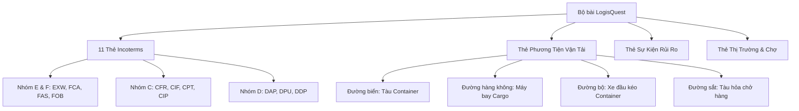

# LogisQuest Game Domain & Rules

Tài liệu chi tiết về mô hình nghiệp vụ, danh mục thẻ bài và luật chơi của Board Game **LogisQuest: Hải trình chuỗi cung ứng**.

---

## 1. Tổng quan trò chơi

- **Thể loại**: Board Game chiến thuật mô phỏng kinh doanh, Logistics và Quản trị chuỗi cung ứng toàn cầu.
- **Số lượng người chơi**: 2 – 4 người (hoặc chia 2 liên minh đối đầu).
- **Thời lượng mỗi ván**: 45 – 75 phút.
- **Mục tiêu**: Người chơi nhập vai các tập đoàn vận tải đa quốc gia, cạnh tranh giành hợp đồng ngoại thương, tối ưu chi phí vận chuyển theo chuẩn Incoterms 2020 và ứng phó với các rủi ro hải trình.

---

## 2. Hệ thống 4 Nhóm Thẻ Bài Cốt Lõi

### 2.1. Nhóm Thẻ Incoterms 2020 (11 thẻ)
Quy định ranh giới chuyển giao trách nhiệm, chi phí và rủi ro giữa người bán (Seller) và người mua (Buyer):
1. **EXW (Ex Works)**: Giao tại xưởng, chi phí người bán thấp nhất, người mua chịu toàn bộ rủi ro bốc xếp & vận chuyển.
2. **FCA (Free Carrier)**: Giao cho người chuyên chở, linh hoạt cho vận tải đa phương thức.
3. **FAS (Free Alongside Ship)**: Giao dọc mạn tàu tại cảng bốc hàng (chuyên dụng cho hàng rời, tàu biển).
4. **FOB (Free On Board)**: Giao lên tàu, rủi ro chuyển giao khi hàng đặt yên vị trên boong tàu.
5. **CFR (Cost and Freight)**: Người bán trả cước tàu biển đến cảng đích, rủi ro chuyển giao ngay khi hàng lên tàu xuất khẩu.
6. **CIF (Cost, Insurance & Freight)**: Giống CFR nhưng người bán bắt buộc mua bảo hiểm đường biển tối thiểu (loại C).
7. **CPT (Carriage Paid To)**: Người bán trả cước vận tải đến điểm hẹn nội địa nước nhập khẩu.
8. **CIP (Carriage and Insurance Paid To)**: Giống CPT nhưng người bán phải mua bảo hiểm mức tối đa (All Risks - loại A).
9. **DAP (Delivered At Place)**: Giao tại nơi đến quy định, sẵn sàng dỡ hàng (chưa dỡ).
10. **DPU (Delivered at Place Unloaded)**: Giao tại nơi đến đã dỡ hàng xuống bãi (người bán chịu rủi ro dỡ hàng).
11. **DDP (Delivered Duty Paid)**: Trách nhiệm người bán cao nhất, nộp mọi loại thuế nhập khẩu và giao tận kho người mua.

### 2.2. Nhóm Thẻ Phương Tiện (Vehicles)
- **Tàu Container (Ultra Large Container Vessel)**: Sức chứa khổng lồ, chi phí mỗi container thấp nhưng tốc độ chậm, dễ chịu ảnh hưởng bởi bão biển.
- **Máy bay chở hàng (Air Freighter)**: Tốc độ giao hàng siêu tốc, không ngại tắc nghẽn cảng biển nhưng cước phí cực kỳ đắt đỏ.
- **Xe tải kéo Container (Trailer Truck)**: Linh động chặng đầu/chặng cuối (First/Last Mile), kết nối kho bãi nội địa.
- **Tàu hỏa vận tải (Freight Rail)**: Độ ổn định cao, tối ưu cước liên vận lục địa Á – Âu.

### 2.3. Nhóm Thẻ Sự Kiện (Events - Risk & Disruptions)
- **Tắc nghẽn Kênh đào Suez**: Phong tỏa tuyến đường biển huyết mạch, tăng chi phí và chậm trễ 2 lượt.
- **Bão nhiệt đới cấp 12**: Thử thách các tàu biển không có bảo hiểm CIF/CIP; có nguy cơ tổn thất hàng.
- **Đình công cảng biển**: Phong tỏa bến dỡ, hàng hóa chuyển về trạng thái chờ phát sinh phí lưu bãi (Demurrage).
- **Biến động giá dầu**: Giá nhiên liệu hỏa xa và tàu biển tăng vọt trong 1 vòng chơi.
- **Luồng Đỏ Hải quan**: Kiểm tra thực tế hàng hóa, người bán theo DDP phải chịu phụ phí giải tỏa.

### 2.4. Nhóm Thẻ Chợ & Hợp Đồng (Market & Trade Cards)
- Các hợp đồng giao dịch hàng hóa (Nông sản, Dệt may, Thiết bị công nghệ bán dẫn, Ô tô).
- Cung cấp điểm thưởng lợi nhuận và điểm danh tiếng Logistics (Logis Rep).

---

## 3. Quy Trình Vòng Chơi (Turn Gameplay Loop)

Mỗi vòng chơi diễn ra qua 4 giai đoạn nối tiếp:

1. **Giai đoạn 1: Dự báo & Rút thẻ Sự kiện (Disruption Phase)**
   - Rút 1 thẻ sự kiện chung cho bàn chơi, tác động trực tiếp đến các chặng hành trình đang vận hành.
2. **Giai đoạn 2: Khai thác Chợ & Nhận Hợp đồng (Procurement Phase)**
   - Đấu thầu hoặc mua thẻ hợp đồng thương mại từ chợ; lựa chọn điều khoản Incoterms thích hợp.
3. **Giai đoạn 3: Điều phối Vận tải & Chuỗi cung ứng (Operation Phase)**
   - Kết hợp thẻ phương tiện với hợp đồng; thanh toán chi phí cước, nhiên liệu và bốc xếp.
4. **Giai đoạn 4: Nghiệm thu & Thanh toán Lợi nhuận (Settlement Phase)**
   - Kiểm tra điểm đến; nếu an toàn vượt qua các sự kiện rủi ro, nhận lợi nhuận và điểm uy tín.

---

## 4. Điều Kiện Chiến Thắng (Victory Conditions)

Người chơi giành chiến thắng khi đạt một trong các mốc sau:
- **Đế chế Chuỗi cung ứng**: Đạt ngưỡng lợi nhuận tài chính mục tiêu (ví dụ: $1,000,000 USD trong game).
- **Bậc thầy Ngoại thương**: Hoàn thành đủ 5 hợp đồng ngoại thương thuộc 5 nhóm Incoterms khác nhau mà không dính phạt rủi ro.
